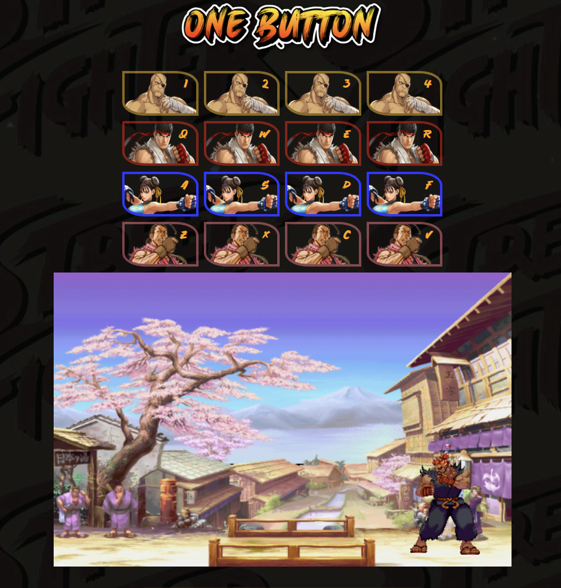

# OneButton: The Street Fighter Soundboard


This is a fun little application that functions as a soundboard for the classic Street Fighter game. It utilizes clicks, touch events, and key presses to trigger sound effects and character animations, bringing back the nostalgia of the arcade era!



## Features

* Play iconic Street Fighter sound effects on demand.
* Trigger character animations to match the sounds.
* Responsive design for a smooth experience on all devices.

### Tech Stack

* **HTML**
* **CSS (SASS):**
* **JavaScript:**

## Usage

1. Clone or download the repository.
2. 
```console
npm start
``` 
3. OneButton is default to port 1337. (http://localhost:1337)
4. Click, tap, or press the designated keys to trigger sounds and animations.

### Demo

You can see a live demo of the application here: [OneButton](https://www.one-button.netlify.app).

### Contributing

We welcome contributions to this project! If you have any ideas or improvements, feel free to fork the repository and submit a pull request.

#### License

This project is licensed under the MIT License. Please refer to the `LICENSE` file for more details.